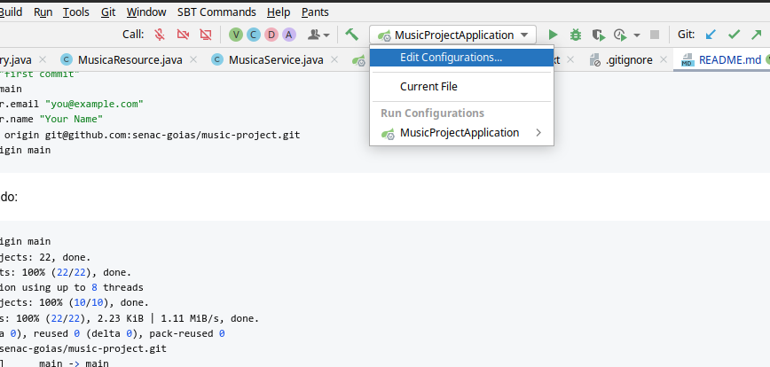
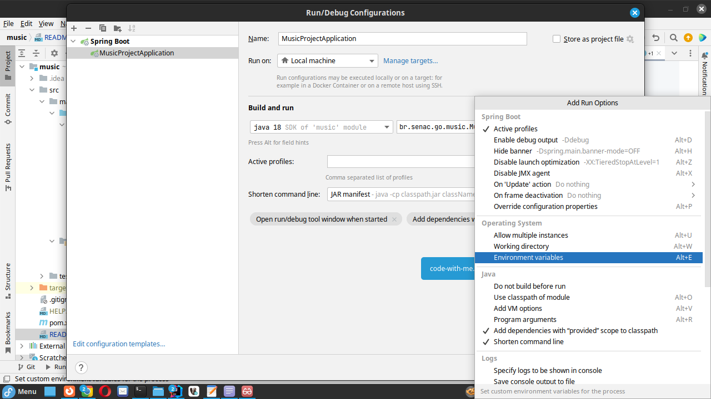
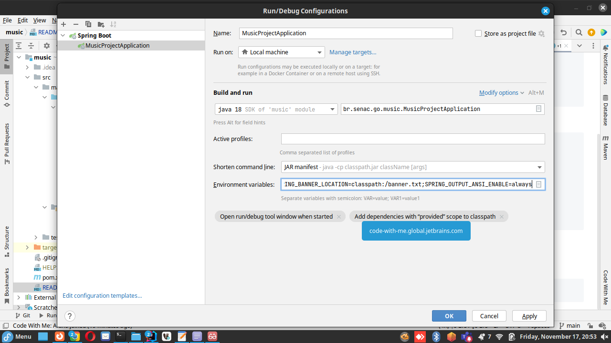

#Aula 08-04

## Roteiro da aula
Transcrever o sql para um ambiente gerenciado por um ORM.

//Jpa (especificação) > Implementações: hibernate, eclipseLink
//hibernate (spring data)

01. Criar o projeto springboot
02. Configurar a estrutura do projeto (yaml, pacotes, pom.xml e as variáveis de ambiente)
    02.1. Iremos inserir o drive do Postgres
03. Criar os pacotes
04. Criar as classes (vazias), num primeiro momento
05. Fazer as anotações (model) de acordo com o modelo do SQL
06. Fazer a estrutura resource > service > repository
    06.1 Fazer as anotações com OpenAPI para criar uma camada de teste(swagger).
07. Podemos fazer um CRUD simples para para persistência de dados.

## SQL gerado em sala de aula

## Configuração do git
```shell
git init
git add .
git commit -m "first commit"
git branch -M main
git config user.email "you@example.com"
git config user.name "Your Name"
git remote add origin https://github.com/senac-goias/ads4-maven-structure-springboot.git
git push -u origin main
```

Resultado esperado:

```shell
git push -u origin main
Enumerating objects: 22, done.
Counting objects: 100% (22/22), done.
Delta compression using up to 8 threads
Compressing objects: 100% (10/10), done.
Writing objects: 100% (22/22), 2.23 KiB | 1.11 MiB/s, done.
Total 22 (delta 0), reused 0 (delta 0), pack-reused 0
To github.com:senac-goias/ads4-maven-structure-springboot.git
 * [new branch]      main -> main
branch 'main' set up to track 'origin/main'
```

### Configuração das variáveis de ambiente
Estas variáveis de ambiente devem ser informadas na configuração do seu projeto.
Seja no build ou seja na configuração do maven

```
SPRING_BANNER_CHARSET=UTF-8;SPRING_BANNER_LOCATION=classpath:/banner.txt;SPRING_OUTPUT_ANSI_ENABLE=always
```

### Configuração das variáveis de ambiente no IntelliJ Community
#### Configuração inicial

#### Opção de configuração das variáveis de sistema

#### Inserindo as variáveis de sistema


## Integração entre as camadas de Resource, Service e Repository
